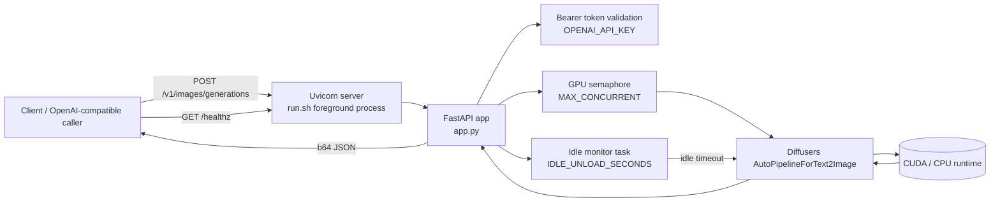

# Architecture Diagram

## Operational notes

- `run.sh` is idempotent: it reuses `~/venv/<project-name>` and reinstalls dependencies only when `requirements.txt` changes.
- `run.sh` runs in the foreground and uses `exec`, so it is compatible with systemd/container supervisors.
- `upgrade.sh` performs explicit dependency upgrades in the same venv path.
- `app.py` can unload the model from GPU when idle (`IDLE_UNLOAD_SECONDS`) and lazily reload on the next request.
