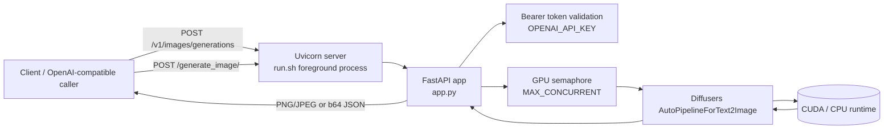

# Architecture Diagram

## Notes
- `run.sh` is idempotent: it recreates/uses `~/venv/<project-name>` and only reinstalls dependencies when `requirements.txt` changes.
- `run.sh` is systemd friendly because it runs in foreground and `exec`s uvicorn.
- `upgrade.sh` upgrades toolchain + project dependencies in the same virtualenv path.
